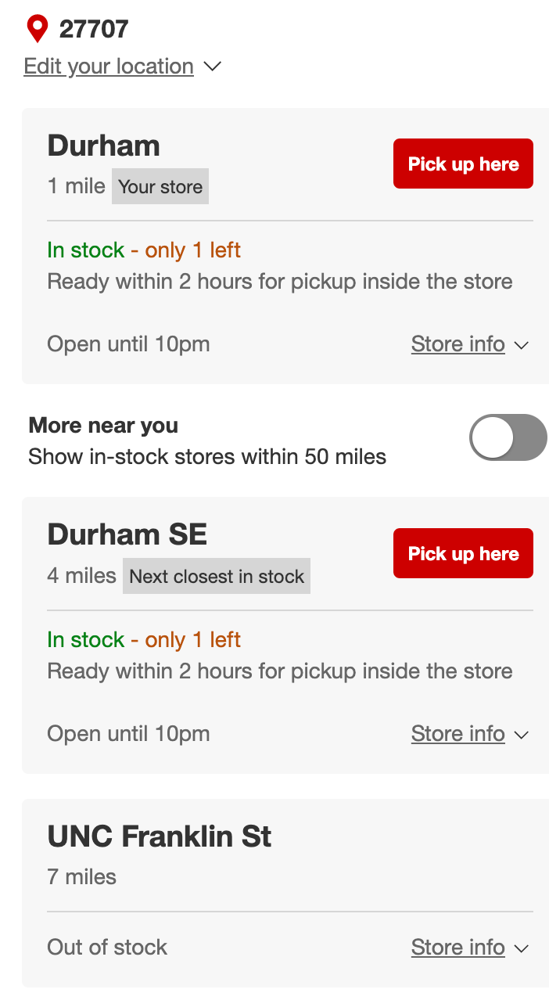

# Nearest-Pickup-Location

The idea of this project is to find the nearest store to pickup a certain item in stock, given your location.\
This is a general idea in E-commerce to identify stores closest to a given zipcode that have a certain product available.

### Example



For this project we will use fast api to provide results in json format.
```
{
  "stores": [
    {
      "name": "Durham",
      "distance": "1 mile",
      "stock": "only 1 left in stock"
    },
    {
      "name": "Durham SE",
      "distance": "4 miles",
      "stock": "only 1 left in stock"
    },
    {
      "name": "UNC Franklin St",
      "distance": "7 miles",
      "stock": "out of stock"
    }
  ]
}

```


## Requirements
 `pip install fastapi`

 `pip install fastapi uvicorn[standard]`

 ## How to Run
 `uvicorn main:app --reload`
 
 (Press CTRL+C to quit)

 ## Dataset
 https://www.kaggle.com/datasets/starbucks/store-locations
 
 ## Additional Documentation
 https://realpython.com/fastapi-python-web-apis/#what-is-fastapi
